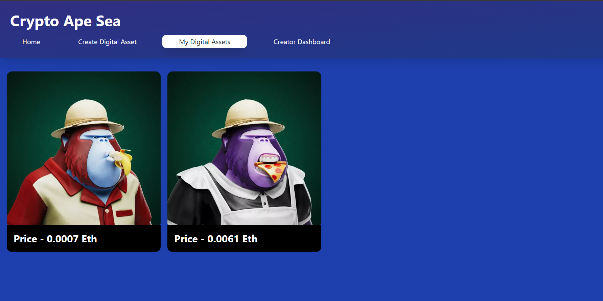

<h1>Deployed at: https://nft-market-place-six.vercel.app/</h1>

<h2>Landing Page</h2>

<h2>Assets Owned Page</h2>

<h2>Create Asset Page</h2>

Step1: npx hardhat run scripts/deploy.js --network mumbai
Step2: npm run dev

